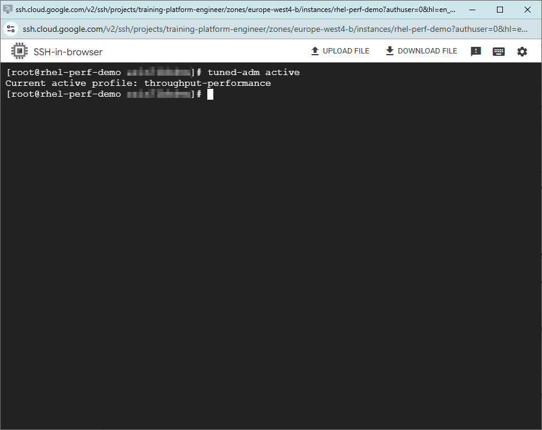
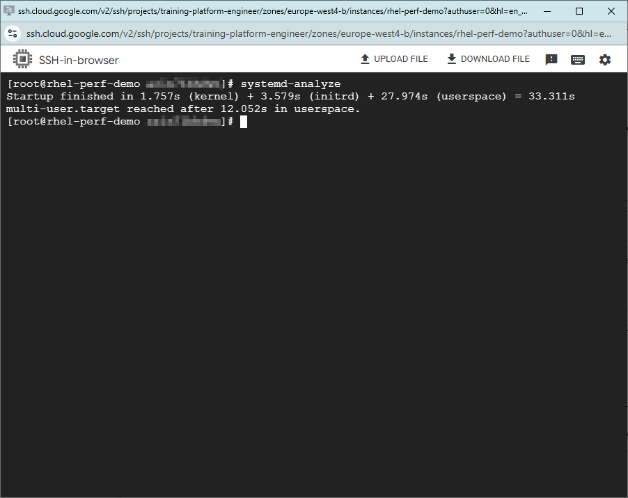
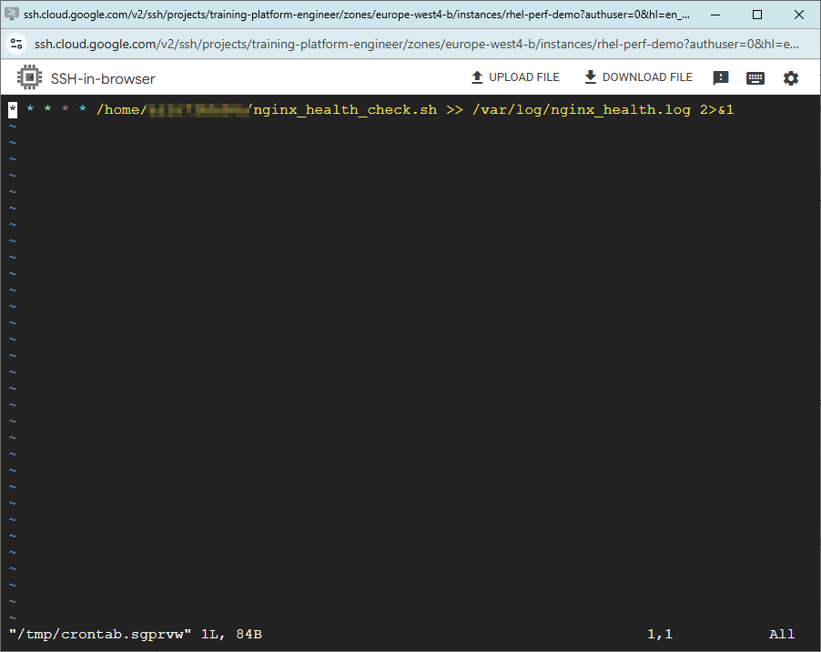
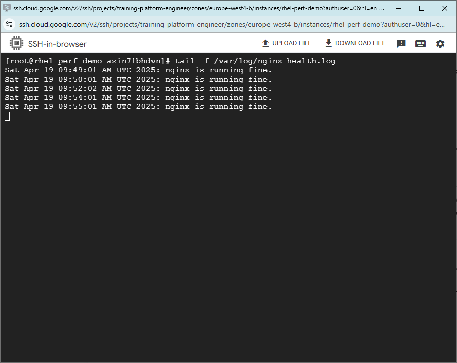

# ⚙️ RHEL Performance Optimization + Auto-Healing Setup

This project demonstrates a real-world optimization scenario on a RedHat-based (CentOS) Linux server, simulating performance tuning and reliability for backend systems in production.

✅ Goal: Reduce downtime and improve response time for critical services  
✅ Stack: CentOS 7 (RHEL-based), Nginx, Cron, Tuned, systemd-analyze

---

## 📁 Project Structure

```text
rhel-performance-optimization/
├── scripts/
│   ├── install_nginx.sh             # Nginx setup script
│   └── nginx_health_check.sh        # Cron-based auto-heal script
├── images/
│   ├── tuned-profile.png
│   ├── systemd-analyze.png
│   ├── healthcheck-log.png
│   └── healthcheck-cronjob.png
├── README.md
```

---

## 🚀 What This Demo Covers

1. Installing and configuring **Nginx**
2. Applying **performance profile tuning** with `tuned`
3. Analyzing **boot performance** with `systemd-analyze`
4. Setting up a **health check cronjob** to auto-restart Nginx if it fails
5. Logging incidents with timestamps to monitor downtime

---

## ⚙️ 1. Nginx Installation

```bash
bash scripts/install_nginx.sh
```

📸 

---

## 🔍 2. Analyze Boot Time

```bash
systemd-analyze
```

📸 

---

## 🛡️ 3. Auto-Healing Cronjob

- Script: `nginx_health_check.sh`
- Runs every 1 minute
- Restarts Nginx if service is down
- Logs to `/var/log/nginx_health.log`

```bash
crontab -e
```

```cron
* * * * * /home/YOUR_USERNAME/nginx_health_check.sh >> /var/log/nginx_health.log 2>&1
```

📸   
📸 

---

## 🎯 Outcomes

- Reduced potential downtime by automatically monitoring services
- Increased system responsiveness with kernel tuning
- Clear logging of incidents for visibility

---

## ✍️ Author

By [Azin Behdarvand](https://www.linkedin.com/in/azin-behdarvand)  
GitHub: [@AzinBehdarvand](https://github.com/AzinBehdarvand)

---

